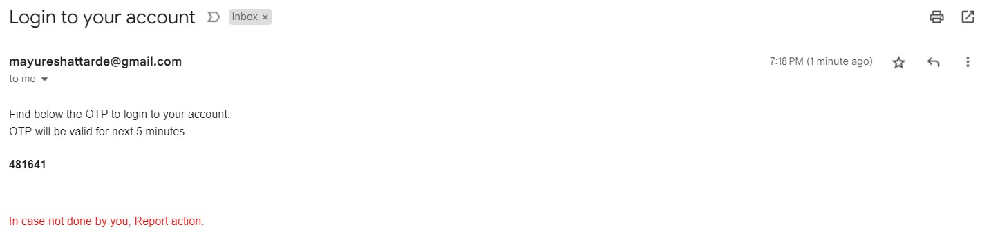
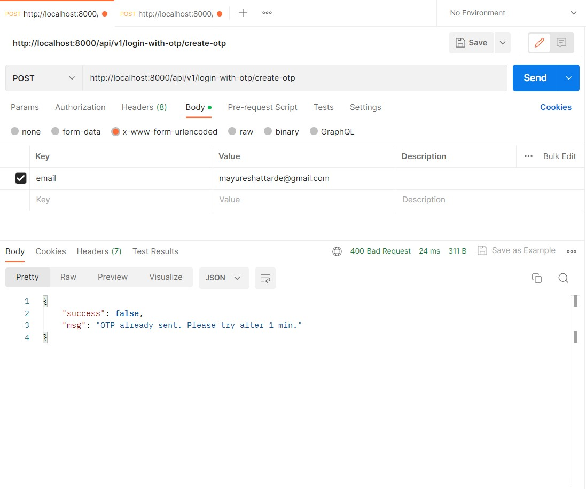
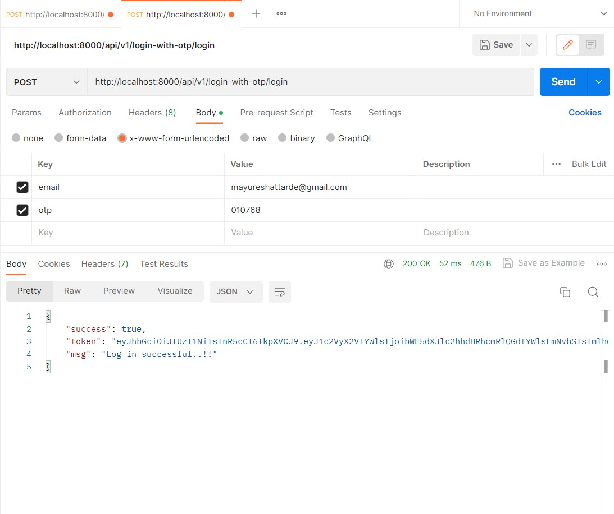
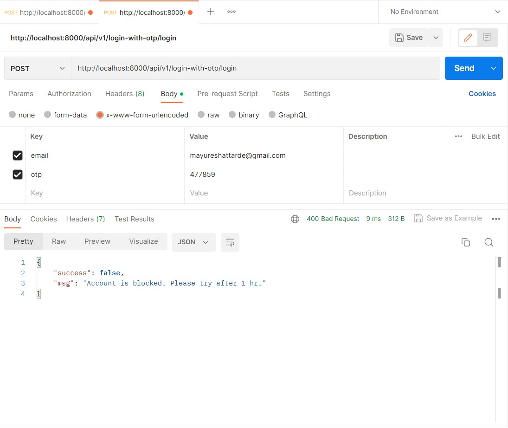
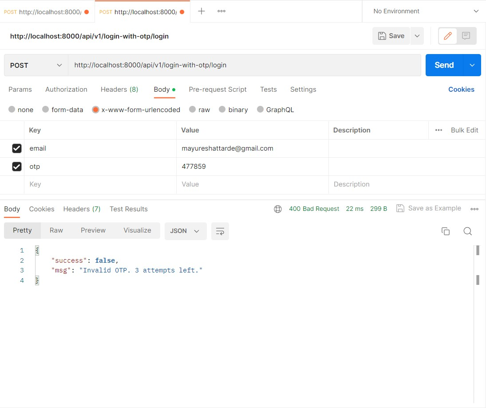
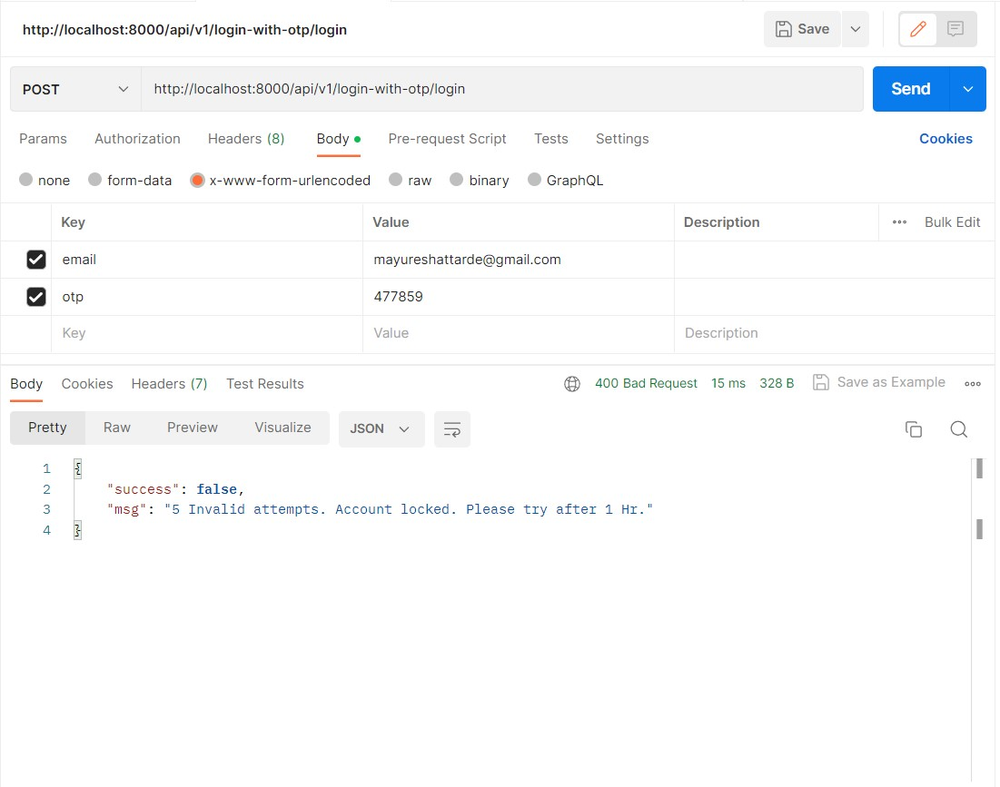

# OTP API
An API for login using OTP. Create a OTP and Login using that OTP.

## Functionalities
1. API to create OTP

    User will send his email address (which also acts as the login id) in the request body. Backend will generate an OTP and send it back to the user on mail.

    > URL [POST] http://localhost:8000/api/v1/login-with-otp/create-otp

    > Successful OTP request.

    

    > OTP on mail.

    

    > Unsuccessful OTP request, when tried sending multiple otp requests within a minute.

    

    > Unsuccessful OTP request, when tried sending otp request for Blocked account.

    

2. API to Login using OTP

    User will send his email address and OTP in the request body. If OTP is valid then generate a new JWT token and send it back to the user.

    > URL [POST] http://localhost:8000/api/v1/login-with-otp/login

    > Successful Login after entering valid OTP.

    

    > Unsuccessful Login, when tried login to blocked account.

    

    > Unsuccessful Login, when tried login with expired otp.

    

    > Unsuccessful Login, when tried login with Invalid otp.

    

    > Unsuccessful Login & Account Block, when tried login with Invalid otp for 5 times.

    

## Getting Started with Ecommerce API

After you have this project in your machine.

**To setup:**

`Google Account`

1. Create an App Password

    Create an App Password for Google account you will use to send mails.

    For that go to your google account settings.

    Then 2 factor authentication.

    Create App Password.

> After setting creating this credentials, update env.js file with credentials created by you.

> Also ensure redis-server is installed and running in your system. Kue will not work without it.

`npm install`

Installs all the dependencies for App that are present in package.json file.

> You can modify MongoDB url if required.

**In the project directory, you can run:**

`npm start`

> You can change port number by modifying env.js file.
